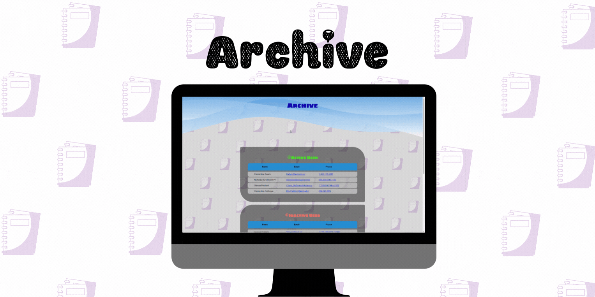

<h1 align="center">Edgemony Bootcamp 2021/2021 - Coding Week</h1>
<h2 align="center">Project Archive 📇</h2>

## Technologies used ##

- HTML
- CSS
- Javascript
- Json API 

## Features: ##

- Fetch Api che restituisce 10 utenti in archivio.
- Aggiunta chiave valore, che ritorna valori di true e false random.
- I contatti sono stati inseriti in due sezioni differenti:
    - sezione I: filtra gli utenti attivi (valori true);
    - sezione II: filtra gli utenti inattivi (valori false);

[Click here to visit it! ](https://floriana83.github.io/Archivio/)